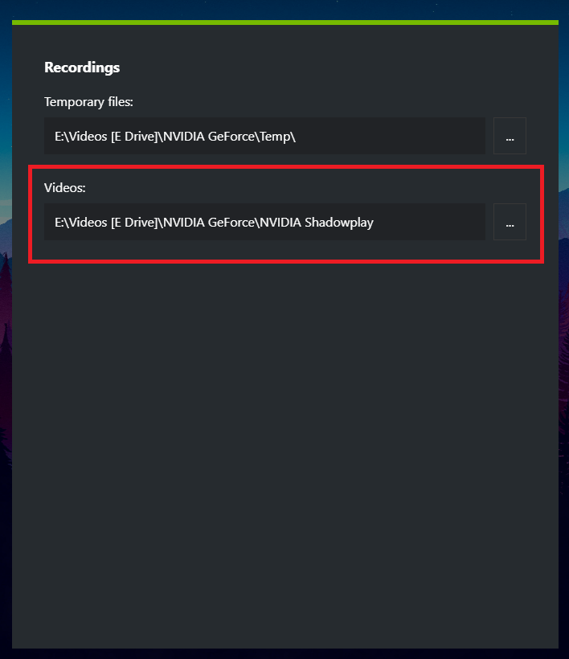

# ShadowPlay Organizer

## Description

A simple file organizer designed for categorizing screenshots and recordings into their own directories saved from NVIDIA ShadowPlay.

## How to run

Open the terminal and navigate to this project's directory. The main `.py` script is in `src/main.py`. Run the command `python src/main.py <recordings_path_here>` shown below and pass the full path to your ShadowPlay recordings as the first and only argument to running the program.

```ps1
python src/main.py "E:/Path/to/ShadowPlay/RecordingsAndScreenshots"
```

## Path to recordings

You can see your recordings path in NVIDIA ShadowPlay by following these instructions:

- Press `alt+z`
- On the right side of the screen, click the gear icon leading to the settings
- Navigate to the `Recordings` section of the settings

After navigating to the `Recordings` section of the settings, you should be able to see the exact same thing as the image shown below. The path to your recordings is the one below the `Videos` option as highligted in the image below with a red rectangle.


